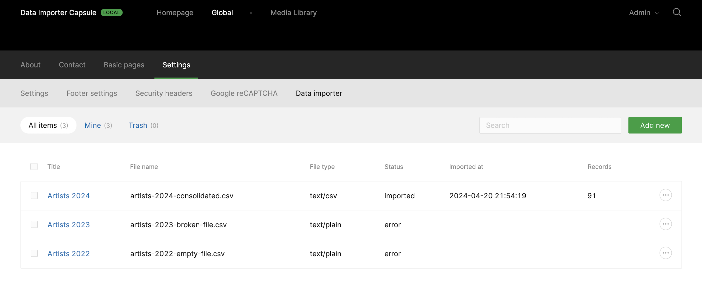
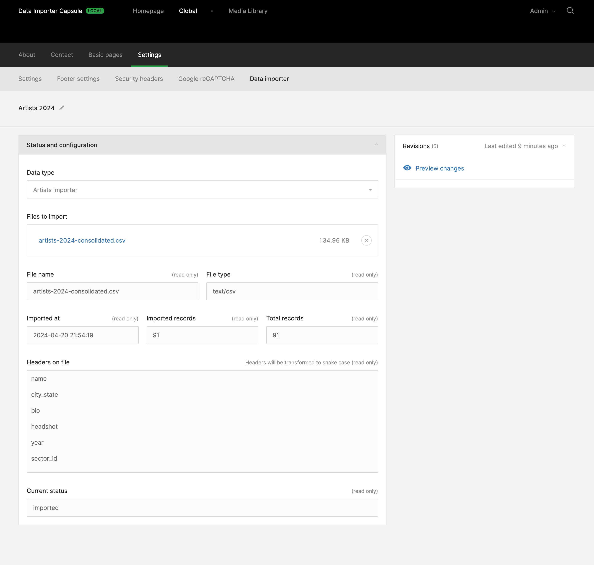

# Data Importer Twill Capsule

This Twill Capsule is intended to enable developers to create data importers (CSV, JSON...) to their Twill application. 

## Screenshots






## Supported Headers


## Installing

## Supported Versions
Composer will manage this automatically for you, but these are the supported versions between Twill and this package.

| Twill Version | Data Importer Capsule |
|---------------|-----------------------|
| 3.x           | 1.x                   |

### Require the Composer package:

``` bash
composer require area17/twill-data-importer
```

### Publish the configuration

Publishing the config file is mandatory as you will need it to configure your importers:

``` bash
php artisan vendor:publish --provider="A17\TwillDataImporter\ServiceProvider"
```
### Install dependencies
This package depends on these other packages, in case you need

| File format | Package                                           |
|-------------|---------------------------------------------------|
| CSV         | [league/csv](https://github.com/thephpleague/csv) |
| JSON        | PHP Extension                                     |

### Usage 

Create an importer class that implements one of the base importers and the `importRow()` and `requiredColumns()` method:

```php
<?php

namespace App\Services\DataImporter;

use Illuminate\Support\Collection;
use App\Twill\Capsules\Artists\Models\Artist;
use App\Twill\Capsules\Artists\Repositories\ArtistRepository;
use A17\TwillDataImporter\Services\Importers\CsvImporter as CsvImporterBase;

class CsvImporter extends CsvImporterBase
{
    protected ArtistRepository $artistRepository;

    public function __construct()
    {
        $this->artistRepository = app(ArtistRepository::class);
    }

    protected array $fieldRelations = [
        'name' => 'full_name',
        'city_state' => 'city_state',
        'bio' => 'bio',
        'headshot' => 'photo_area_1',
        'year' => 'year',
        'sector_id' => 'book_covers',
    ];

    public function requiredColumns(): Collection
    {
        return collect($this->fieldRelations)->keys();
    }

    public function importRow($row): bool
    {
        $artist = new Artist();

        $data = [];

        foreach ($row as $key => $value) {
            $field = $this->getField($key);

            if (is_null($field)) {
                $this->error("CsvImporter class: field '$key' not found");

                return false;
            }

            $data[$field] = $this->translate($value, $artist, $field);
        }

        $this->artistRepository->firstOrCreate(['full_name' => $data['full_name']], $data);

        return true;
    }

    private function getField(string $key): string|null
    {
        return $this->fieldRelations[$key] ?? null;
    }

    private function translate($value, Artist $artist, string $field): string|array|null
    {
        if (collect($artist->translatedAttributes)->contains($field)) {
            return ['en' => $value];
        }

        return $value;
    }
}
```

Then set your importers on the `config/twill-data-importer.php` config file:

```php
<?php

return [
    'importers' => [
        'default' => [
            'caption' => 'Select an importer',
        ],

        'artists' => [
            'caption' => 'Artists importer',

            'mime-types' => [
                'text/csv' => \App\Services\DataImporter\ArtistsCsvImporter::class,
                'text/plain' => \App\Services\DataImporter\ArtistsCsvImporter::class,
            ],
        ],

        'artworks' => [
            'caption' => 'Artworks Importer',

            'mime-types' => [
                'application/json' => \App\Services\DataImporter\ArtworksJsonImporter::class,
            ],
        ],
    ],
];
```

If you just need one single type of importer you can just use the default configuration:

```php
<?php

return [
    'importers' => [
        'default' => [
            'mime-types' => [
                'application/json' => \App\Services\DataImporter\ArtworksJsonImporter::class,
            ],
        ],
    ],
];
```

There will be no select input to chose between different types of importers in the edit page.

### Menu

Packages are added to the main menu automatically by Twill, but if you are clearing the Twill menu in order to create one from scratch yourself, you will need to add it manually:

```php
TwillNavigation::clear();

...

TwillNavigation::addLink(
    NavigationLink::make()
        ->forModule('TwillDataImporter')
        ->title('Data importer')
);
```

## Update Twill Media Library metadata 

Another example of importer is to use a CSV file:

```csv
filename,alt_text,caption,credits
filename.jpg,The alt text,The caption of your image,A possible (extra) credits metadata field
```

To update the metata of images previously imported in batch mode. Here's the importer code:

```php
<?php

namespace App\Services\DataImporter;

use A17\Twill\Models\Media;
use Illuminate\Support\Collection;
use App\Twill\Capsules\Artists\Models\Artist;
use App\Twill\Capsules\Artists\Repositories\ArtistRepository;
use A17\TwillDataImporter\Services\Importers\CsvImporter as CsvImporterBase;

class ImagesMetadataCsvImporter extends CsvImporterBase
{
    protected ArtistRepository $artistRepository;

    public function __construct()
    {
        $this->artistRepository = app(ArtistRepository::class);
    }

    protected array $fieldRelations = [
        'filename' => 'filename',
        'alt_text' => 'alt_text',
        'caption' => 'caption',
        'credits' => 'credits',
    ];

    public function importRow($row): bool
    {
        $media = null;

        foreach ($row as $key => $value) {
            $field = $this->getField($key);

            if ($field === 'filename') {
                $media = $this->findMedia($value);

                if ($media === null) {
                    break;
                }

                continue;
            }

            if ($value === null || $media === null) {
                continue;
            }

            $media->{$field} = $value;
        }

        if ($media === null) {
            return false;
        }

        $media->save();

        return true;
    }

    private function getField(string $key): string|null
    {
        return $this->fieldRelations[$key] ?? null;
    }

    private function translate($value, Artist $artist, string $field): string|array|null
    {
        if (collect($artist->translatedAttributes)->contains($field)) {
            return ['en' => $value];
        }

        return $value;
    }

    public function requiredColumns(): Collection
    {
        return collect($this->fieldRelations)->keys();
    }

    private function findMedia(mixed $value): Media|null
    {
        return Media::where('filename', $value)->first();
    }
}
```

## Contribute

Please contribute to this project by submitting pull requests.
