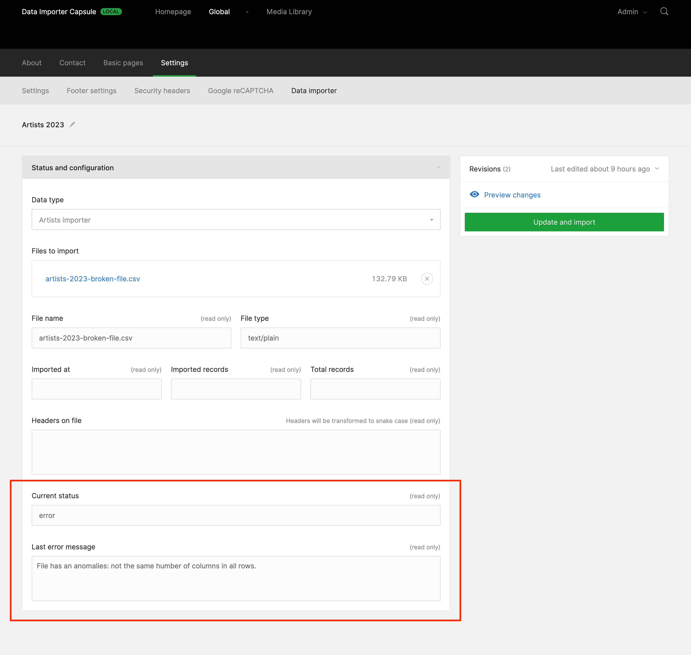

# Data Importer Twill Capsule

This Twill Capsule is intended to enable developers to create data importers (CSV, JSON...) to their Twill application. 

## Screenshots

### CMS configuration


### [Mozilla Observatory](https://observatory.mozilla.org) security headers check



## Supported Headers


## Installing

## Supported Versions
Composer will manage this automatically for you, but these are the supported versions between Twill and this package.

| Twill Version | Data Importer Capsule |
|---------------|-----------------------|
| 3.x           | 1.x                   |

### Require the Composer package:

``` bash
composer require area17/twill-data-importer
```

### Publish the configuration

``` bash
php artisan vendor:publish --provider="A17\TwillDataImporter\ServiceProvider"
```
### Install dependencies
This package depends on these other packages, in case you need

| File format | Package     |
|-------------|-------------|
| CSV         | league/csv  |

### Usage and menu
It's pretty straightforward, once installed you will have access to the menu option `Twill Data Importer`, which is a single page having all the supported headers that you can enable, disable and edit the properties to sent with the response.

If you are clearing the Twill menu in order to create a new one yourself, you will need to add it manually:

```php
TwillNavigation::clear();

...

TwillNavigation::addLink(
    NavigationLink::make()
        ->forModule('TwillDataImporter')
        ->title('Data importer')
);
```

## Disabling

In case you don't reset the menu, this package is enabled and injects itself automatically. To disable it you just need to add to `.env`:

```dotenv
TWILL_DATA_IMPORTER_ENABLED=false
```

## Contribute

Please contribute to this project by submitting pull requests.
